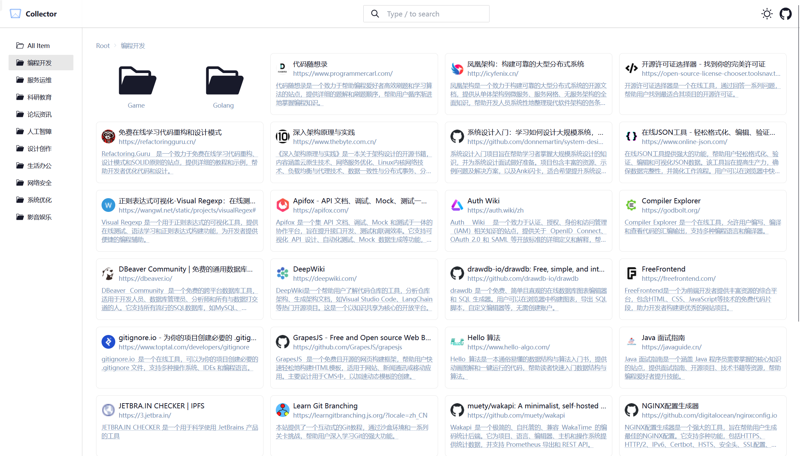
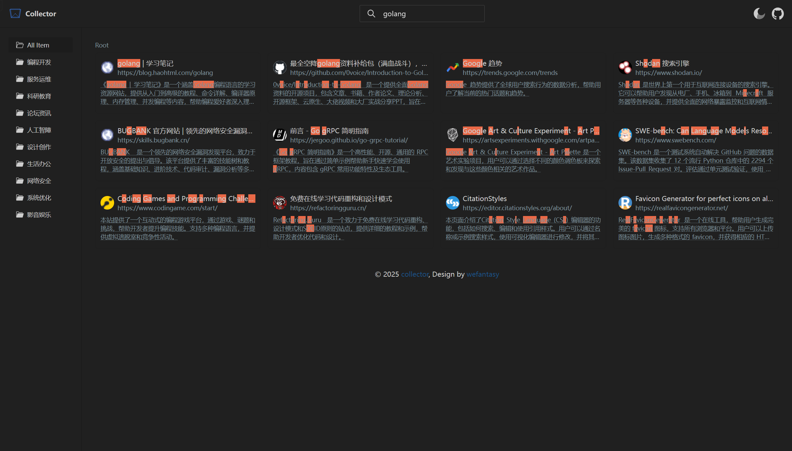

# Collector

[](LICENSE)
[](https://svelte.dev)
[](https://kit.svelte.dev)

Collector 是一个简约的个人导航站点，帮助您高效管理和分类收藏的网站。支持多级分类、模糊搜索、多搜索引擎切换以及明暗主题，开箱即用，部署简单。

## 功能特性

- 📁 **多级分类导航** — 支持目录树结构，配合侧边栏和面包屑快速定位
- 🔍 **模糊搜索** — 基于 Fuse.js，支持标题、标签、描述多维加权检索，结果高亮
- 🔄 **多搜索引擎切换** — 一键切换书签搜索 / Google / Baidu / Bing，点击搜索图标即可轮换
- 🎨 **主题切换** — 浅色 / 深色 / 跟随系统，偏好自动持久化，防闪烁
- 🖼️ **智能 Favicon** — 自动从多源（DuckDuckGo、Google）加载图标，带文字兜底
- ⌨️ **键盘快捷键** — 按 `/` 快速聚焦搜索框
- 📱 **响应式设计** — 移动端侧栏抽屉适配，全端可用
- 🔝 **回到顶部** — 滚动超过 300px 后显示，平滑滚动

## 示例




## 技术栈

| 类别 | 技术 |
|------|------|
| **前端框架** | [Svelte](https://svelte.dev) v5（runes 响应式） |
| **应用框架** | [SvelteKit](https://kit.svelte.dev) v2（static adapter） |
| **构建工具** | [Vite](https://vitejs.dev) v6 |
| **UI 框架** | [DaisyUI](https://daisyui.com) v4 + [TailwindCSS](https://tailwindcss.com) v3 |
| **图标库** | [Iconify](https://iconify.design)（动态选择器） |
| **搜索引擎** | [Fuse.js](https://fusejs.io) v7（模糊搜索） |

## 快速开始（GitHub Pages 部署）

1. [Fork](https://github.com/CallmeLins/collector/fork) 本项目到你的 GitHub 账户
2. 在你 Fork 的仓库中，进入 **Actions** → **I understand my workflows, go ahead and enable them** 启用 Workflows
3. 点击 **Actions** → **Build and Deploy** → **Run workflow**，选择 `main` 分支运行，**等待构建完成**
4. 进入 **Settings** → **Pages** → **Branch**，选择 `gh-pages` 分支并 `Save`
5. 编辑 `static/data.json` 添加你的收藏链接，推送到 `main` 分支即可自动部署
6. 访问：`https://<你的用户名>.github.io/collector/`

## 本地开发

### 环境要求

- [Node.js](https://nodejs.org) ≥ 18.x（推荐 22.x）
- [pnpm](https://pnpm.io) ≥ 8.x

### 步骤

```bash
# 克隆仓库
git clone https://github.com/CallmeLins/collector.git
cd collector

# 安装依赖
pnpm install

# 启动开发服务器（默认 http://localhost:8888）
pnpm run dev

# 构建生产版本
pnpm run build

# 本地预览生产构建
pnpm run preview
```

## 项目结构

```
collector/
├── src/
│   ├── lib/
│   │   └── components/
│   │       └── BackTop.svelte    # 回到顶部组件
│   ├── routes/
│   │   ├── +layout.js            # 全局布局配置（预渲染）
│   │   ├── +layout.svelte        # 全局布局
│   │   ├── +page.js              # 首页数据加载
│   │   └── +page.svelte          # 首页主逻辑（搜索、导航、主题）
│   ├── app.css                   # 全局样式 & CSS 变量
│   └── app.html                  # HTML 入口（主题防闪烁）
├── static/
│   ├── data.json                 # 收藏数据（JSON）
│   ├── favicon.svg               # 站点图标
│   └── img/                      # 示例截图
├── .github/workflows/
│   └── build-and-deploy.yml      # GitHub Actions 部署流水线
├── svelte.config.js              # SvelteKit 配置（static adapter）
├── vite.config.js                # Vite 配置（端口 8888）
├── tailwind.config.js            # Tailwind / DaisyUI 主题
├── eslint.config.js              # ESLint 配置
├── .prettierrc                   # Prettier 配置
└── package.json                  # 项目依赖与脚本
```

## 数据配置

编辑 `static/data.json` 即可管理你的收藏。支持多级文件夹结构：

```json
[
  {
    "title": "分类名称",
    "type": "folder",
    "children": [
      {
        "title": "站点名称",
        "url": "https://example.com",
        "icon": "",
        "categories": "分类名称",
        "tags": "标签1,标签2",
        "description": "站点描述"
      }
    ]
  }
]
```

- **title** — 书签标题，也用于搜索
- **url** — 链接地址
- **icon** — 自定义图标 URL（留空则自动从 DuckDuckGo / Google 获取 favicon）
- **categories** — 所属分类
- **tags** — 逗号分隔的标签，用于搜索
- **description** — 描述文字，用于搜索

## 贡献指南

欢迎任何形式的贡献！

1. Fork 本仓库
2. 创建特性分支：`git checkout -b feature/amazing-feature`
3. 提交改动：`git commit -m 'feat: add some amazing feature'`
4. 推送到远程：`git push origin feature/amazing-feature`
5. 提交 Pull Request

## 许可证

本项目采用 [MIT 许可证](LICENSE)。

## 致谢

本项目最初基于 [wefantasy/collector](https://github.com/wefantasy/collector) 进行开发与修改，感谢原作者的开源与贡献。
